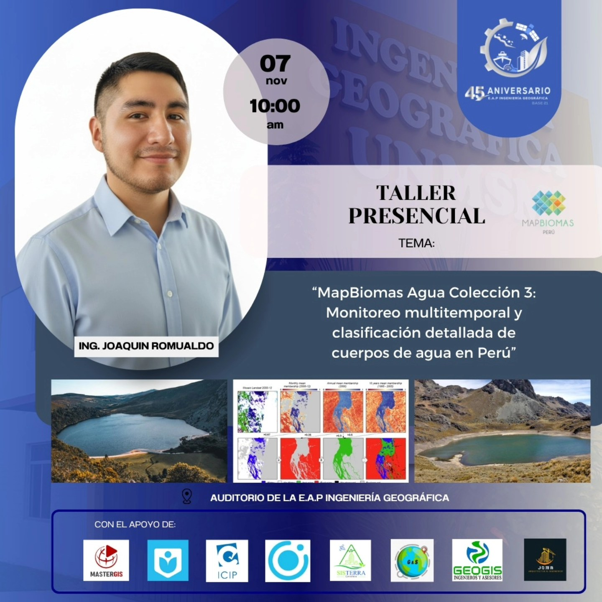

# 🌊 **Water Classification**

## 📌 **Description**

Scripts used in the workshop "Detection of water bodies using Remote Sensing in Google Earth Engine", carried out within the framework of the celebration of the 45th anniversary of the Professional Academic School Geographic Engineering of UNMSM.

## 🧪 **Workshop Objectives**

- Review basic concepts of remote sensing.
- Understand the spectral properties of water bodies.
- Become familiar with the Google Earth Engine interface (code editor).
- Filter satellite images based on cloud cover, location, date, etc.
- Filter and manipulate vector data (shapefiles).
- Apply algorithms to improve the quality of satellite images.
- Detect water bodies using spectral indices.
- Detect water bodies using endmembers.
- Explore the MapBiomas Water dataset and learn about the platform.

## 📂 **Scripts**

### **1. ImageCollection:** [01_ImageCollection](./scripts/01_ImageCollection.js)

In this script, we will:
- Import Landsat images
- Filter images (location, date, properties)
- View all images in an ImageCollection
- Sort an ImageCollection based on a property
- View an image in different band combinations
- Apply a map() function to an ImageCollection
- Apply a reduce() function to an ImageCollection
- Import feature collections (shapefiles)
- Crop an image based on a feature

### **2. MosaicQuality:** [02_MosaicQuality](./scripts/02_MosaicQuality.js)

In this script, we will:
- Create mosaics with reduced cloud cover using the Band Quality Assurance (BQA)
- Create mosaics with reduced cloud cover using the CloudScore function
- Visualize the difference between both methods

### **3. SpectralIndices:** [03_SpectralIndices](./scripts/03_SpectralIndices.js)

In this script, we will:
- Generate the NDWI for a Landsat 5-8 image
- View the NDWI histogram to choose an appropriate threshold
- Mask bodies of water
- Test other spectral indices (MNDWI, NDMI)
- Identify errors in the atmospheric correction of Landsat 8

### **4. Endmembers:** [04_Endmembers](./scripts/04_Endmembers.js)

In this script, we will:
- Identify bodies of water based on a methodology that involves endmembers and probabilities.
- Compare the detection results with those obtained using NDWI.

## 👤 Autor

Joaquín Romualdo
